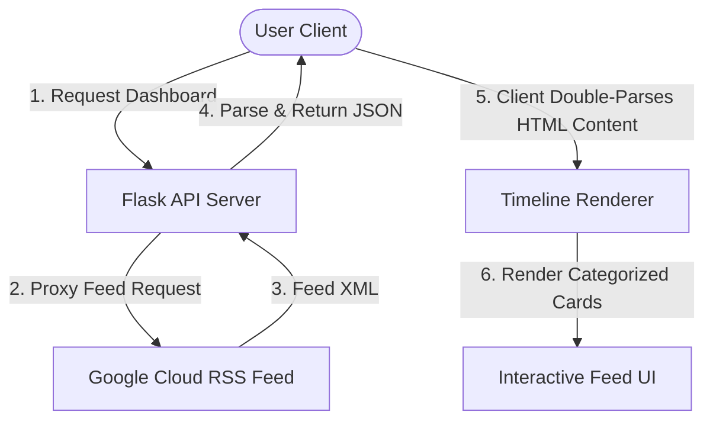

# 📊 BigQuery Release Notes Explorer

A premium, interactive web application built with **Python Flask** and **Vanilla HTML5/CSS3/JavaScript** that aggregates, double-parses, and visualizes the official Google Cloud BigQuery Release Notes XML feed.

[](https://github.com/Saurabh-Niwate/antigravity-event-talks-app)
[](https://www.python.org/)
[](https://flask.palletsprojects.com/)

---

## ✨ Key Features

*   **Real-Time Feed Fetching**: Automatically acts as a proxy to fetch Google Cloud's RSS feed, bypassing CORS policies.
*   **Intelligent Double-Parsing**:
    *   **Server-Side**: Extracts entry metadata (ID, updated timestamp, title, and HTML payload) from XML feed items.
    *   **Client-Side**: Dynamically parses the nested HTML using browser `DOMParser` to extract, normalize, and divide updates into distinct category cards.
*   **Aesthetic Chronological Timeline**: Grouped chronologically by day, showing visual status badges and animations for features, changes, deprecations, notices, and issues.
*   **Search & Filtering System**:
    *   **Keyword Search**: Live client-side search indexing matching entry titles, content body, and date tags.
    *   **Category Filtering**: Quick action pills to narrow updates to a specific type.
    *   **Sorting**: Swap order instantly between *Newest First* and *Oldest First*.
*   **Dashboard Stats Banner**: Provides visual numbers for overall features, deprecations, and issues, utilizing dynamic counter animations.
*   **Dual-Theme Theme Engine**: Persistent Dark and Light modes based on the user's system preferences or toggle choice, saved automatically in `localStorage`.
*   **Deep Link Sharing**: Generating unique hash URLs pointing to individual release notes. Clicking these links automatically scrolls to, highlights, and flashes the targeted update.

---

## 🛠️ Technology Stack

*   **Backend**: Python (Flask)
*   **Frontend**: HTML5, Vanilla JavaScript (ES6+), CSS3 Variables & Design Tokens
*   **Icons**: Lucide Icons
*   **Typography**: Google Fonts (Inter, Outfit)

---

## 📂 Repository Structure

```text
antigravity-event-talks-app/
├── README.md                 # Main workspace documentation (This file)
└── bq-releases-notes/
    ├── app.py                # Flask server application
    ├── requirements.txt      # Python dependencies
    ├── README.md             # Subfolder documentation
    ├── static/
    │   ├── css/
    │   │   └── style.css     # Global styles, color tokens, animations, layout
    │   └── js/
    │       └── app.js        # Timeline parser, rendering loop, theme manager
    └── templates/
        └── index.html        # SPA dashboard HTML template
```

---

## 🚀 Quick Start Guide

### Prerequisites

Ensure you have **Python 3.8+** installed on your system.

### 1. Navigate to the project folder
```bash
cd bq-releases-notes
```

### 2. Create and Activate Virtual Environment
*   **Windows (PowerShell)**:
    ```powershell
    python -m venv venv
    .\venv\Scripts\activate
    ```
*   **macOS / Linux**:
    ```bash
    python3 -m venv venv
    source venv/bin/activate
    ```

### 3. Install Dependencies
```bash
pip install -r requirements.txt
```

### 4. Start the Flask Server
```bash
python app.py
```

The server will spin up locally at **`http://127.0.0.1:5000`**.

---

## 🔄 How the Data Flows



---

## 📄 License
This project is open-source and available under the MIT License.
